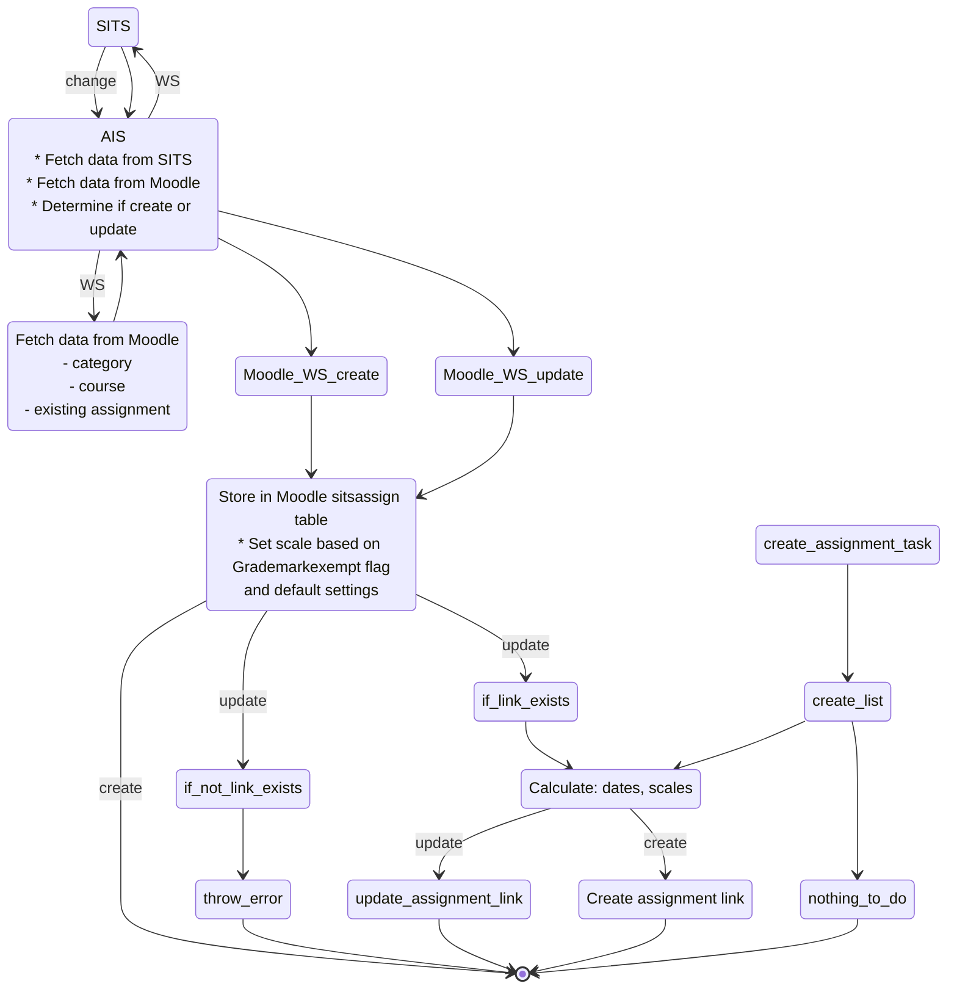
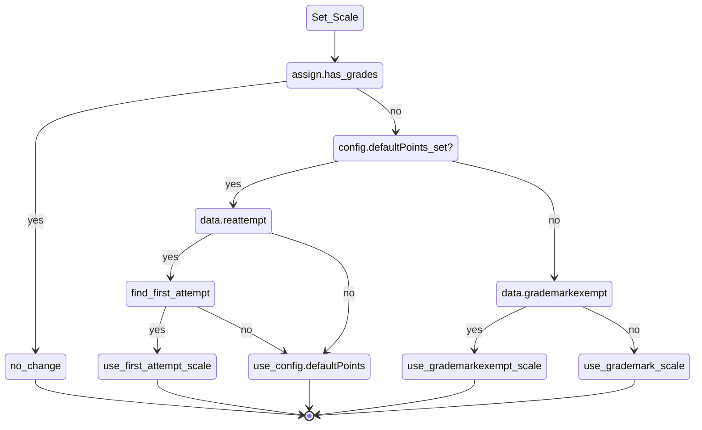

# Assignment Workflow diagrams

## SITS assignment change

## Set scale based on Grademarkexempt flag and default scale settings

Note: If the assignments exists, and already has grades, the scale is not changed, otherwise the scale is changed on update, depending on the settings.

